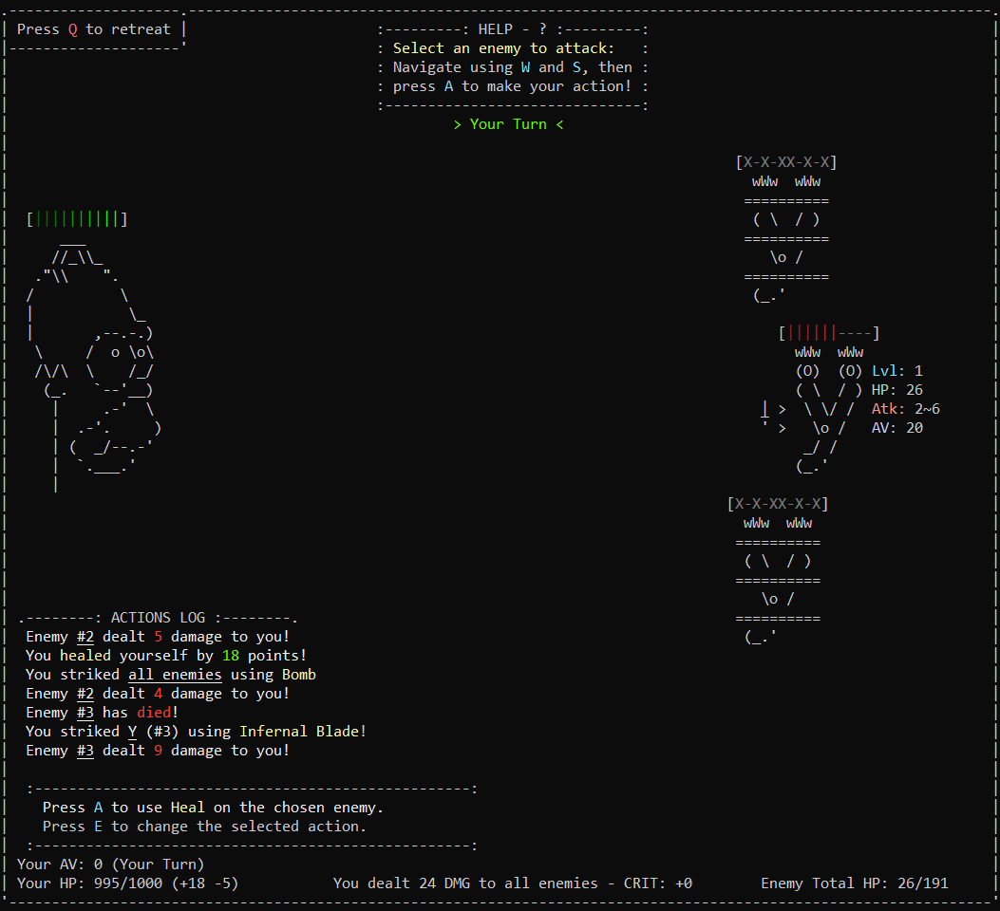
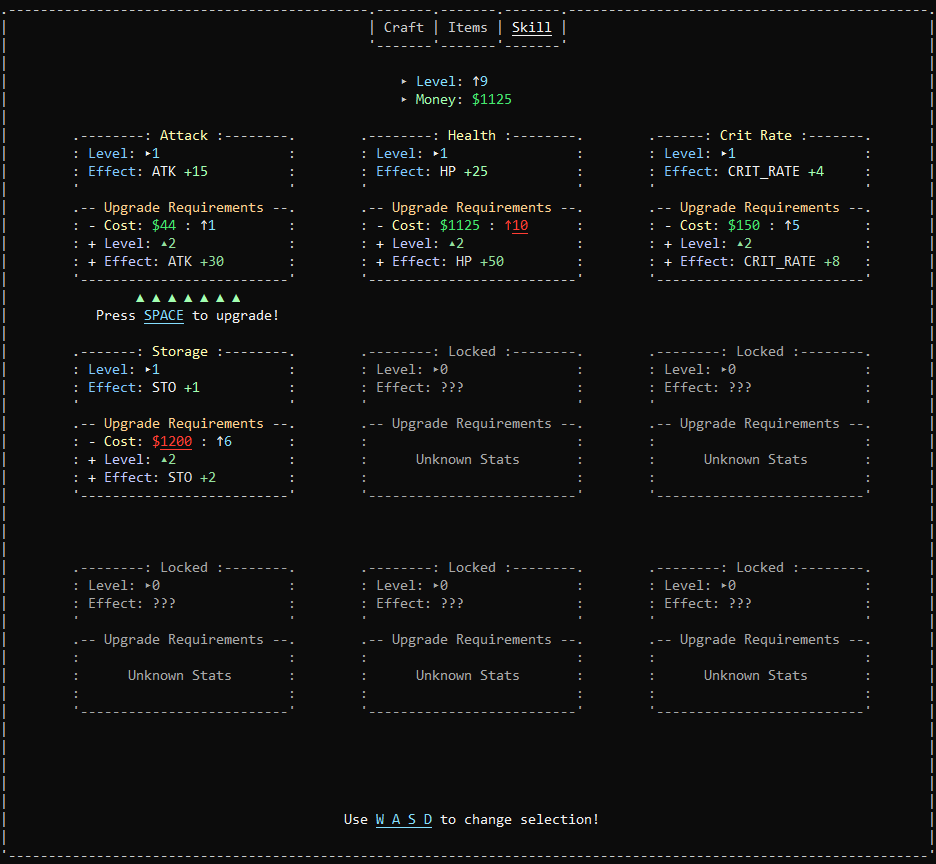

<div align="center">

#  Battles of Batch
  
[](https://github.com/136MasterNR/Battles-of-Batch#-battles-of-batch) [](https://github.com/136MasterNR/Battles-of-Batch/releases) [](https://github.com/136MasterNR/Battles-of-Batch/stargazers)

##### _Copyright (C) 2023, 136MasterNR_

</div>

Battles of Batch is a RPG text game built for the Windows MS-DOS terminal version 10. Wanderers fight in various battles against a variety of enemies as they progress through the game. They can complete quests, acquire new items and weapons, and experience the game's story.
##### The project was initiated by 136MasterNR on August 13, 2021.<br/><br/>

## Download/Installation Process, Requirements & Notes
  - **Latest release**: [Battles.Of.Batch.-.v0400.-.Third.Alpha.Release.zip](https://github.com/136MasterNR/Battles-of-Batch/releases/latest/download/Battles.Of.Batch.-.v0400.-.Third.Alpha.Release.zip)
  - **Source code**: [Battles-of-Batch-main.zip](https://github.com/136MasterNR/Battles-of-Batch/archive/refs/heads/main.zip)

After the download is complete, simply extract and run the batch file `BattleOfBatch.bat`.

Battles of Batch is currently only available on Windows, with a required command line version at least 10.0.1 and higher.

**Recommended Command Prompt settings**:
- **Font size**: 18 or 20 (for 1080p displays), 13 (for 720p displays)
- **Font family**: Consolas

The game's launcher requires VBScript on your system. It uses VBScript to launch all additional tasks in the background. If you have a specific issue with it, delete the file [data\scripts\invisible.vbs](./data/scripts/invisible.vbs) and all invisible tasks should appear minimized on your taskbar instead.

This project uses [ANSI](https://www.robvanderwoude.com/ansi.php) as a text formatter. It's used to manage displayed text and colors on the console. It's required for almost any display-related feature to work as intended.

Please note that the Source Code version contains untested features, you should use a release instead, do not report issues otherwise.
# About
### Contact (#1.0)
  - **Social Media**: [Reddit](https://www.reddit.com/r/BattlesOfBatch/) \(for Community & Support\)
### Copyright (#1.1)
  - **Read**: [Copyright](copyright.txt)
  - **Read**: [License](license.txt)

# Game Details & How To Play

### Game Controls (#2.0)
Press ***CTRL*** + ***W*** on some User Interfaces to get more information about it.
  - **Menu**: 
    - ***A***/***P***: Level Selection.
    - ***Q***: View your Quests.
    - ***W***: Workshop & Upgrades.
    - ***S***: Change your Options and general Preferences.
    - ***E***: Check out your Character & Inventory.
    - ***Z***: To Craft or Upgrade Items.
    - ***X***: Buy items from the in-game Workshop.
    - ***C***: View and upgrade your Skills.
    - ***V***: View the [Credits](#credits).
    - ***P***: Manage your profiles.
    - ***CTRL*** + ***Q***: Exit the game.
    - ***CTRL*** + ***R***: Restart the game.
    - ***CTRL*** + ***SHIFT*** + ***6***: Reset all saved data.
    - ***CTRL*** + ***SHIFT*** + ***-***: LGBTQIA+
  - **Character**
    - ***A***: Equip items.
    - ***D***: Equip weapons.
    - ***X***: Customize your character's appearance.
    - ***P***: Manage your profiles.
    - ***Q***: Return to the menu.
  - **Map**: 
    - ***A***/***Enter***: Start Selected Level.
    - ***D***: Move Forward/Next Level.
    - ***S***: Move Backwards/Previous Level.
    - ***Q***: Move to the previous UI (Menu).
    - Press any **number** to immediately move to a level.
  - **Battle**: 
    - ***A***: Make your action.
    - ***E***: Choose an item from your inventory.
    - ***Z***: Cast special skill.
    - ***Q***: Retreat current battle and go back to the map UI.
	- ***CTRL*** + ***R***: Restart battle.

## Strategy & Details

### How it Works : Combat (#3.0)
  - Battles of Batch features a turn based combat mechanic, with various features associated within it.
  - Both players and enemies have AVs (Action Values), AV indicates who has the next turn, and in which order. It's important to take note of one's AV so you can make your plan.

### How it Works : Effects (#3.1)
  - Some effects are turn-based damages, it can be applied on both the player and the enemy. Effects such as poison or fire are useful for damaging the enemies without the need of any more additional player actions. Other effects such as slow down or weakness, can be used to debuff the player or enemy for a set of turns.
  - **Slow Down**: This effect will increase the action value of the enemy or player, basically slowing them down by a bit.
  - **Fire**: This effect will damage the enemy or the player every registered turn, for a set amount of turns.
  - **Poison**: This effect will damage the enemy or the player every registered round, for a set amount of rounds.
  - **Bleed**: This effect will damage the enemy or the player every registered turn, until the item Heal is used.

### How it Works : Enemies (#3.2)
  - Enemies spawn with a random amount of HP, the amount increases depending on the enemy's level.
  - Enemies deal a random amount of damage to the player, the amount increases depending on the enemy's level.
  - Every enemy deals its own damage, which means once one enemy is dead it will no longer deal damage, dealing less total damage to the player.
  - Some enemies have special ablities, such as poisoning the player, or other self-buffs.

### How it Works : Skills (#3.3)
  - **Main Attack**: Increases your base damage.
  - **Crit Rate**: Increases the chance to throw a critical strike to an enemy.
  - **Max Health**: Increases maximum HP by 100.

### How it Works : Items (#3.4)
  - **Bomb**: Stuns enemies, skipping their next round/action. Bosses cannot be stunned by this attack type. Effects, such as poison on the player, will still function (Not yet an implemented feature).
  - **Heal**: Increases the HP of the player. This does not skip the next enemy round/action, and the player will still take damage as usual. Can stop bleeding effects.
  - More Coming Soon!

<details><summary>

### List of all Items (Click) Items (#3.4.1)

</summary>

```
Note
  Some stuff in here are not yet released.

About
	Items, such as weapons and armour, are used in-game to boost stats, such as extra attack damage or critical strikes etc., they can also give special buffs or any debuffs.
	Artifact items can be used to buff the player, debuff enemies or deal damage.
	Items are upgradable, every item can be upgraded 15 times. Once an item is upgraded, its level will be increased by one. Every upgrade will increase the
	item's stats by 115%. To upgrade an item witha level of 15 or higher, you must own at least one material of Mythril. The materials required to upgrade an
	item increases as the level of the item is increased.

Weapon Items [Released]
	Dustblade (Short Blade) {Base Damage: 8}
	Cold Twill (Short Bow) {Base Damage: 20} [Bonus Effects: Slows down the enemy by 25 action points]
	Comrade Hammer (Kusarigama) {Base Damage: 45} [Bonus Effects: 50% Chance to deal a total amount of 350% damage)
	Stylefi (Long Bow) {Base Damage: 60} [Bonus Effects: Extra 10% Crit Rate]
	Flora Thrower (Magic Wand) {Base Damage: 75} [Bonus Effects: 10% Chance to Poison a single enemy, lasts for a total of 2 rounds]
	Trident of Gawra (Trident) {Base Damage: 80} [Bonus Effects: 40% Chance to stun the targeted enemy, skipping their next round]
	Infernal Blade (Greatsword) (Base Damage: 85) [Bonus Effects: 80% Chance to set on fire the targeted enemy, dealing 20% of your base damage on every round]
	Ornate Cobalt (Shield) {Main Damage: 200} [Bonus Effects: Shares an extra amount of 20% of your base damage to all enemies]
	Brainleader (Magic Ball) {Base Damage: 250} [Bonus Effects: An extra amount of 9750 damage is dealt to ALL enemies on every single round. Debuff: Loe -99% HP every time you make an action.]

Artifact Items [Releasing]
	Healing Potion (Lvl 1 Buff Item) {Effects: Heals you by 25% when used, and another 4% for the next 2 turns, can stack}
    Reactive Bomb (Lvl 4 Buff Item) {Effects: Deals an additinal 20% of your base damage to all enemies, and 100% normal damage to the selected enemy.}
	Oracle Shield (Lvl 4 Buff Item) {Effects: Take 30% less damage for 2 rounds, 20% chance to stun each enemy, skipping their next round}
	Cup of Misery (Lvl 8 Buff Item) {Effects: Extra 10% base damage for 4 rounds}
	Totem of Salute (Lvl 10 Buff Item) {Effects: When used, it will increase your HP by 25% once it gets lower than 1%}
	Barrel Bomb (Lvl 14 AoE Attack Item) {Effects: Deals an additinal 60% of your base damage to all enemies}

Armour Items [Not Released]
	Boots of the Aether (Lvl 45) {Effects: Increases HP by 20%, automatically heals you by 20% every 3 rounds, if HP already maxed then max HP increases by 20%}

Material Items [Released]
	Stained Dust (Lvl 1 Material)
	Black Wood (Lvl 4 Material)
	Reactive Powder (Lvl 6 Material)
	Francium (Lvl 8 Material)
	Light Resin (Lvl 12 Material)
	Double Marble (Lvl 18 Material)
	Prism Dust (Lvl 18 Material)
	Exalted Nickel (Lvl 24 Material)
	Mythril (Lvl 30 Material) {Used to upgrade items over level 15}
	Palladium (Lvl 44 Material)
	Eternal Ethereal (Lvl 57 Material)
  ```

</details>

### How it Works : Crafting Items (#3.5)
  - You can craft items by accessing the Shop, and switching to the Craft tab or otherwise by pressing Z on the menu. Every item requires materials for it to be crafted, once you gather all required materials, you will be able to craft your item.
  - Items serve a rich in-game usage. You can equip weapons and other items such bombs or healing pots through your inventory. Weapons usually give you a big boost when it's about fighting enemies, they can give you extra damage and bonus effects.

## Enemy Details
### How Enemies Were Designed (#4.0)
  - The design of the enemies were inspired by the Latin characters and other references. These enemies are unable to wield any weapons, thus they could only upgrade their defense. That's the reason they have way too much HP. Enemies that seem to have something sharp on them can deal a much larger amount of damage compared to other enemies.
  
  - Additionally, some other enemeis have special abilities or combat skills that aren't based on damage but instead on other combat mechanic elements, this fact can make them extremely dangerous when fought unexpectedly.

  - Large amounts of enemies can be extremely difficult to fight, but they have their weaknesses too. For example, if their main weapon is too short there's much more chance for them to miss a hit (Not yet an implemented feature).

### List of Enemies & their Traits
  - **Yara**: This enemy has very low damage and health points. Has 20% chance to inflict you with fire for 1 to 2 turns.
  - **Jumpo**: It can be found on the second level. Its design gets inspiration from a Sea-Horse. It's very known for how strong it is, because of its very sharp, strong but small tail.
  - **Nimbo**: This enemy is a supporter. It has very strong defense system. It has 75% chance to advance forward other enemies, which basically lets them take action qucker than usual by resetting their action points back to 0.
  - **French**: This enemy is the stronger version of Jumpo. Because of how hard and heavy it is, it deals a very large amount of damage, has a decent amount of defense, and can cause the bleeding effect with power value of 2.
  - **Weavy**: More Info Soon!
  - **Boi**: More Info Soon!
  - **Zorm**: More Info Soon!
  - **Twu**: More Info Soon!
  - **Nein**: More Info Soon!
  - **Uno**: More Info Soon!
  - **Snek**: More Info Soon!
### Hard Level (#4.3)
  - More Coming Soon!

# Levels & Story

<details><summary>

### Chapter 1 [Click] (#5.0)

</summary>

  - **Prologue**:
    - Enemies: [Yara](https://github.com/136MasterNR/Battles-of-Batch#easy-level), [Yara](https://github.com/136MasterNR/Battles-of-Batch#easy-level), [Yara](https://github.com/136MasterNR/Battles-of-Batch#easy-level)
    - Story: More Info Soon!
  - **Level 1**:
    - Enemies: More Info Soon!
    - Story: More Info Soon!
  - **Level 2**:
    - Enemies: More Info Soon!
    - Story: More Info Soon!
  - **Level 3**:
    - Enemies: More Info Soon!
    - Story: More Info Soon!
  - **Level 4**:
    - Enemies: More Info Soon!
    - Story: More Info Soon!
  - **Level 5**:
    - Enemies: More Info Soon!
    - Story: More Info Soon!
  - **Level 6**:
    - Enemies: More Info Soon!
    - Story: More Info Soon!
  - **Level 7**:
    - Enemies: More Info Soon!
    - Story: More Info Soon!

</details>

<details><summary>

### Chapter 2 [Click] (#5.1)

</summary>

  - **Level 8**:
    - Enemies: More Info Soon!
    - Story: Coming Soon!
  - **Level 9**:
    - Enemies: More Info Soon!
    - Story: Coming Soon!
  - **Level 10**:
    - Enemies: More Info Soon!
    - Story: Coming Soon!
  - **Level 11**:
    - Enemies: More Info Soon!
    - Story: Coming Soon!
  - **Level 12**:
    - Enemies: More Info Soon!
    - Story: Coming Soon!
  - **Level 13**:
    - Enemies: More Info Soon!
    - Story: Coming Soon!
  - **Level 14**:
    - Enemies: More Info Soon!
    - Story: Coming Soon!

</details>

<details><summary>

### Chapter 3 [Click] (#5.2)

</summary>

  - **Level 15**:
    - Enemies: More Info Soon!
    - Story: Coming Soon!
  - **Level 16**:
    - Enemies: More Info Soon!
    - Story: Coming Soon!
  - **Level 17**:
    - Enemies: More Info Soon!
    - Story: Coming Soon!
  - **Level 18**:
    - Enemies: More Info Soon!
    - Story: Coming Soon!
  - **Level 19**:
    - Enemies: More Info Soon!
    - Story: Coming Soon!
  - **Level 20**:
    - Enemies: More Info Soon!
    - Story: Coming Soon!
  - **Level 21**:
    - Enemies: More Info Soon!
    - Story: Coming Soon!

</details>

# User Interfaces
### Menu (#6.0)
  - The menu is decorated with various ASCII art, and the title at the top. In the middle, you can view your general stats such as your Level, your Money and your Next Battle. Below you can see the commands which let you navigate to other user interfaces. When shortcut keys enabled, press to A to navigate to the [Map](https://github.com/136MasterNR/Battles-of-Batch#map-61) interface, Q (which stands for Quests) to the [Quests](https://github.com/136MasterNR/Battles-of-Batch#quests-65) interface, W (which stands for Workshop) to the [Workshop](https://github.com/136MasterNR/Battles-of-Batch#shop-64) interface, E (which stands for Equipment) to the [Character & Equipment](https://github.com/136MasterNR/Battles-of-Batch#character--equipment-63) interface, S (which stands for Settings) to the [Settigns](https://github.com/136MasterNR/Battles-of-Batch#settings-66) interface.


### Map (#6.1)
  - The Map interface allows you see all the available levels, and navigate through available chapters. At the top, you can view information about the current level & chapter, such as the Battle's title (Story Title), the next Battle, your Total Wins and more information about the selected level, such as the general difficulty, the recommended level and the enemies that will appear in battle.


### Battle (#6.2)
  - The Battle interface is the only place where you will encounter your true enemies. The enemies will appear at the right side of your screen, waiting for your first action. At the top, you can view the current turn, the current numeric turn and current numeric round. At the bottom, you can view the action logs, which shows a list of recently made actions, and below that you can view the currenlty equipped item. Pressing E will reveal your inventory, allowing you to swap between your equipped items. Right at the bottom, you can view your player HP, your AV (Action Value), the damage you last dealt, and the total HP of all enemies together.


### Character & Equipment (#6.3)
  - The Character & Equipment interface lets you view your character's statistics, customize your character, view your character's history (based in the story) and lets you to equip or unequip items and weapons. At the top center you can view you character and at the right and left you can view the statistics of your character such as, your username, your money, your level, your experience, your total health points, your strength, your chance to strike critical hit and your defense. Below you can view your Items + Equiped Items, your Materials and your Weapons + Equipped Weapons. More statistics are shown when you move to the equipment UI.


### Shop (#6.4)
  - **Items**: Items require in-game currency and specific character level. The level requirement is displayed as the symbol "↑", and currency as the symbol "$". The UI is categorized in 3 categories, first is Weapons and other sources that deal damage, second is Crafting Materials which are used for crafting items or weapons, and third is Potions and Other, which are used as support items.

  - **Skills**: Upgrading skills is very important. It gives you an amount of permanent benefits in the game. To upgrade a skill, you first have to meet the requirements such as an amount of in-game currency, which is represented as the symbol "$", and a specific player level, which is represented as the symbol "↑". Select a skill by moving using the keys `W` `A` `S` and `D`. If you meet the requirements to update the selected skill, press `A`.

  - **Craft**: More Info Soon!


### Quests (#6.5)
  - Quests are important for quickly progressing through the game. Once a quest has been completed, you get rewarded with lots of XP and Coins.


### Settings (#6.6)
  - The settings UI lets you customize your preferences. By typing the name of an option, you can toggle it to true or false, or you can set a specific value to it.


# Explaining Technical Features
### Saves Manager (#7.0)
  - How your game data are stored:
    - All your game data are saved in a single local directory in your appdata; `%appdata%\HTS_DATA`. Battles of Batch's directory is named after its PHASE and VERSION. On `%appdata%\HTS_DATA`, you will find the game named as `BATTLESOFBATCH-%PHASE%-%VERSION%`, where `%PHASE%` stands for the stage of the project, and `%VERSION%` the game version, e.g. `BATTLESOFBATCH-INDEV-0400`. Under that directory are the child directories `SAVES`, `SETTINGS` and `main.config`. Under the SAVES directory, you will find your profile's player data. On your first start-up of the game, it automatically creates the player data saves under your game's appdata path directory.
  - How the saving system works:
    - The game automatically saves your progress every time your player data variables are modified. The script used for this process does not rewrite the whole save file, it only modifies lines on it. For example, if you complete a quest, it will only change the line where that quest is saved on, that also goes for total completed levels and the rest.
  - How your inventory is managed:
    - Your in-game inventory is a complete different process than the ones mentioned above. There are no variables in your inventory save files, this fact makes this saves manager one of the most difficult things coded in this game. Your inventory is managed by a script called `items.cmd` located in `.\data\scripts\playerdata`, and it manages files in `SAVES\inv\`, files such materials, regular items, and weapons. Your inventory save data is completely dynamic, this means that data written in it can easily be modified by other scripts and leaving it empty won't affect it at all. To store an item in your player data, it must include its name and its level (or amount). When an item's amount reaches a value of 0, it no longer stays in your player data, instead the items script uses its name to search for the line position and then completely wipe out that line leaving all the other items present. When an item with the same name of an existing item tries to save in, it just stacks up and increases the amount value instead of saving the same item twice. When the game requests the manager to take data from the save files, there's a very complex way of doing this; first, the script seperates every single line into temporary variables, then take that line in another process and seperate every part of it into other usable variables. I hope that sounds simple.
  - Profiles Manager:
    - The profiles manager creates multiple save data for you. Your profile will appear on `%appdata%\HTS_DATA\BATTLESOFBATCH-%phase%-%version%\SAVES\`. Under that directory, you will see folders named after the profiles you created. The first profile will be created automatically upon launching the game, by the name "Wanderer". Profile names will effect your in-game name, e.g. how you will be called in the story.
  - Saves encryption:
    - Coming Soon!

### Auto Updater (#7.2)
  - When you start the game, the updater will launch at some point in the startup and check for an update. It pulls information from [get-update](https://github.com/136MasterNR/HTS-Studios/tree/main/get-update), compares your local game's version with the online version and then prompts you to whether you wish to update or not before completely loading into the game. After you confirm to update, the updater will pull the whole game from [get-download](https://github.com/136MasterNR/HTS-Studios/tree/main/get-download) and will replace all your old game files with the new game files. This will not reset your saves, but if the next update requires you to reset your saves, you will be prompted for a second confirmation.

### Error Handler (#7.3)
  - More Info Soon!

# For Developers
*When developing something on your own, you should use the DLC packs. **DO NOT** edit the game itself as it may corrupt it entirely or cause misbehaviour! Follow the guides provided in the example DLC pack or below.*
### Create your own levels using the Level Editor (#8.0)
  - The [LevelEditor.cmd](data/cmd/leveleditor.cmd) lets you to create your own levels, with a user friendly interface, making is extremely simple to create new enemies and edit their data. To enter the Level Editor, you must unlock the terminal as mentioned [here](https://github.com/136MasterNR/Battles-of-Batch#use-commands-for-devs-83), then enter a level and press ***CTRL + P***. First, start with creating your new enemy by pressing C, you will be prompted to enter the enemy's type and level. You can find the list of enemies in [enemy.cmd](data/scripts/game/enemy.cmd). Using ***W A S D J*** and ***L*** you can move the enemy around, changing their screen position. You can use ***CTRL + R*** to undo all changes, and ***R*** to refresh the menu. Once you are done editing the level, you have to press ***P*** to save all changes permanently.

### Create your own enemies (#8.1)
  - Coming Soon!

### Create your own items (#8.2)
  - Coming Soon!

### Use Commands for Devs (#8.3)
  - To unlock the terminal, go to the settings and type in "IAMADEVELOPER", all in caps.
  - For shortcut, go to the menu and hit ***CTRL + T*** to access the game's terminal. Exit using `exit`.
  - After entering the terminal, type in `commands` to show all available commands and their information. Below you can read some extra information about a few commands.
    - **debug**: Enables manual debugging mode, it gives more information on some User Interfaces, reverts some User Interfaces back to preDev versions and creastes debug files. Created for development purposes.
    - **import**: Display an [ANSI](https://www.robvanderwoude.com/ansi.php) text file. Use `.ans` as a file type. Use an argument after the command, e.g. `import mysupertxt`. Make sure to move your ansi text in the directory `.\data\cmds\`.
#### Example commands (#8.4)
  - **Set player money**: ECHO OFF & CALL "%SAVE%" "FILE=%DATA_SAVES%\PLAYERDATA.cmd" 1 /A PLAYER.MONEY= 50000 & ECHO ON

# FAQ
  - Q: **Why in Batch?**
    - A: **I started this project as a challenge for myself. Making a game in such a tricky and weirdly-made langauge might have been hell, but a great challenge. But I ended up being a masochist, so here we are now.**
  - Q: **Should I contribute into the project?**
    - A: **For your own fucking good, DO NOT contribute unless you hate yourself more than I hate myself. Contributing is worse than creating a batch project from scratch for this very simple reason; unreadability.**

# Credits
  - **Programmed** by
    - 136MasterNR

  - **Story directed** by
    - 136MasterNR
    - johnypro150

### Pixel Art
  - **Enemy Designs** by
    - ThePurgeKing

### Ascii Art
  - **Character Designs** by
    - [asciiart.eu](https://www.asciiart.eu/)
    - [patorjk.com](https://patorjk.com/)
    - 136MasterNR

  - **User Interfaces** by
    - 136MasterNR

### Sounds
  - **Music** provided by 
    - [pedi me arxes](https://www.youtube.com/c/pedimearxes) provided [Dangerous Plains](https://www.youtube.com/watch?v=rF9K51_3p10)
    - [Alexander Nakarada](https://www.serpentsoundstudios.com) provided [Village Ambiance](https://www.youtube.com/watch?v=VKKSQ4UHLRE) and [Winter Night](https://www.free-stock-music.com/alexander-nakarada-winter-night.html)

  - **SFX** provided by
    - [epicstockmedia.com](https://epicstockmedia.com/)
    - [SOUND and IMAGE FX](https://www.youtube.com/channel/UCQvVl9c7RKpyO5aKwxtb_lw) provided the swing sfx.
### Special Thanks

  - **Shoutout** to my **Testers**:
    - Bench
    - BlackStorm
    - 2002Spiele
    - [ComradeTurtle](https://github.com/ComradeTurtle) [OLD]
    - AgentANP [OLD]
    - JayKayHere3987 [OLD]

### More information on this project will be added in this read me every now and then :shipit:
